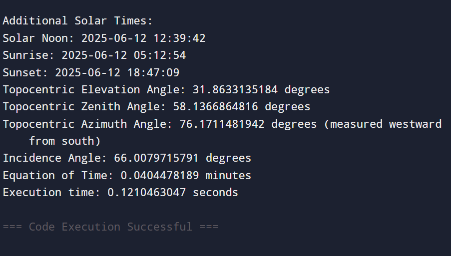
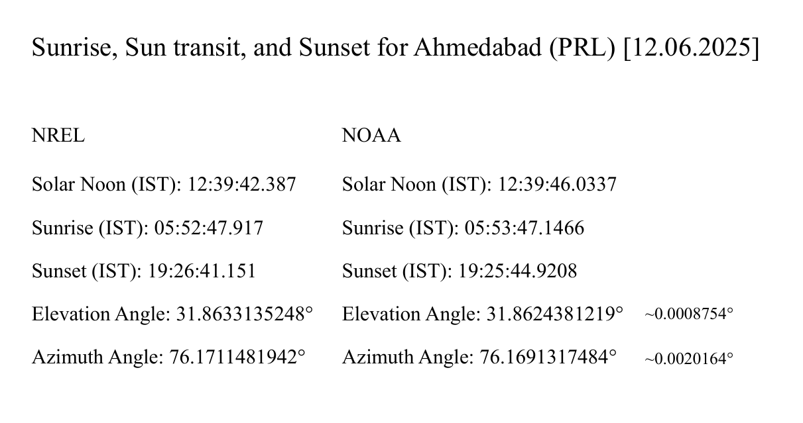
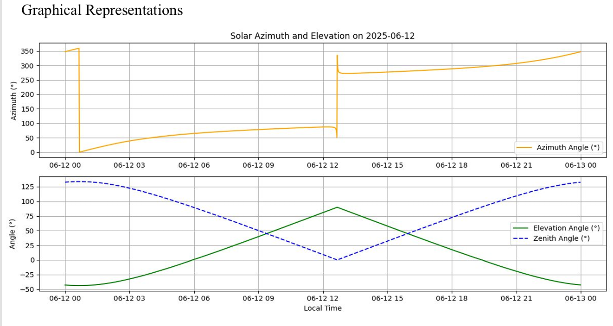
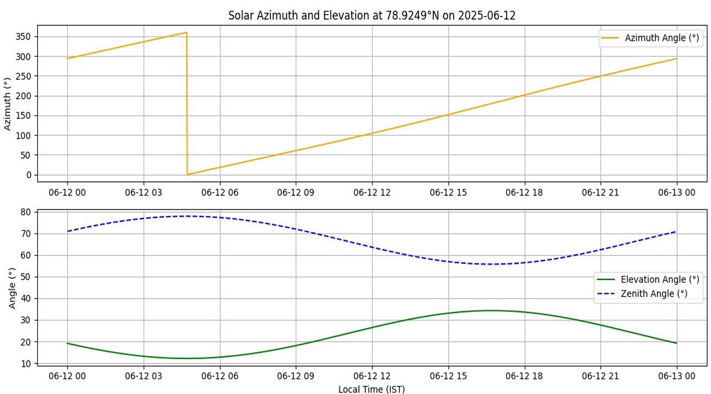
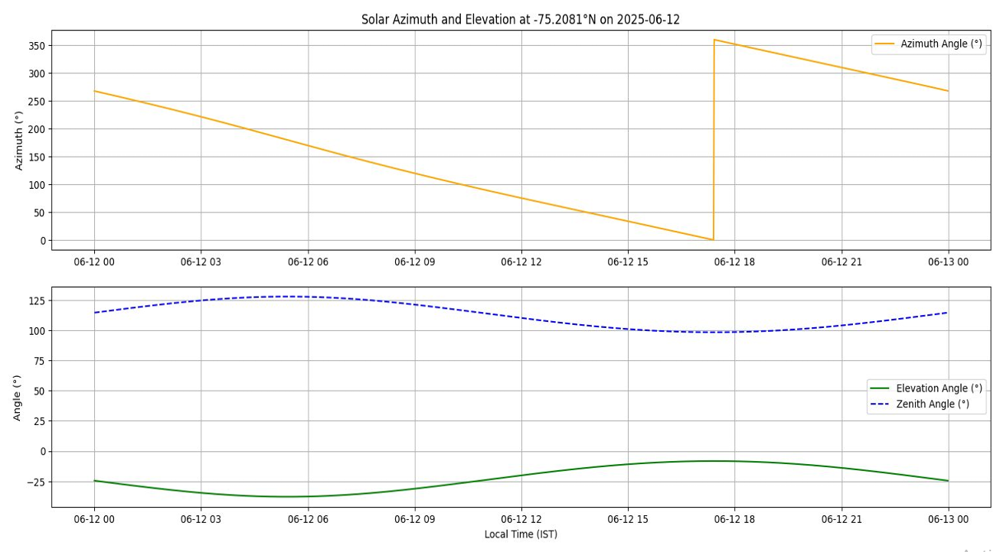

# Solar Position Calculator

This project implements a high-precision solar position calculator to determine solar azimuth and elevation angles for any geographic location.

# Features
- Implements NREL Solar Position Algorithm
- Uses VSOP87 planetary theory
- Includes corrections for nutation, aberration, and atmospheric refraction
- Minute-by-minute solar position calculations

# Tools Used
Python
NumPy
Matplotlib

# python code
[solar_position.py](solar position.py)

# Example Output

# Applications
Solar energy systems
Astronomical calculations
Satellite tracking
