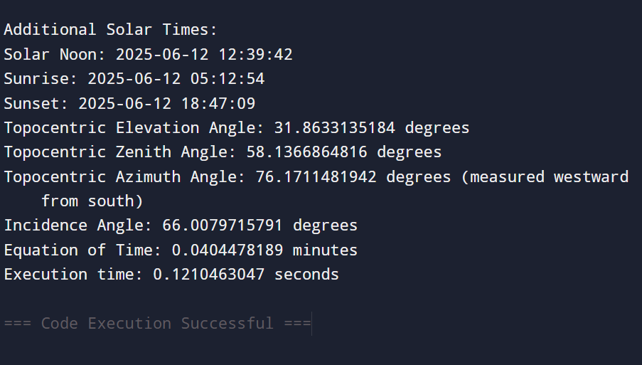
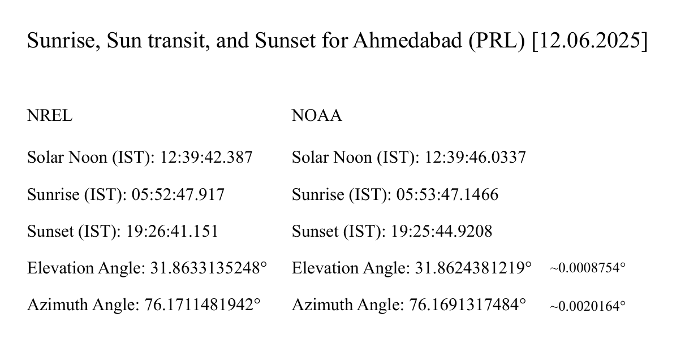
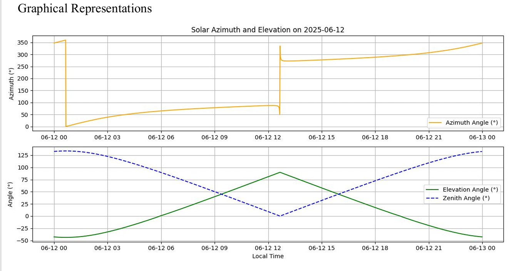
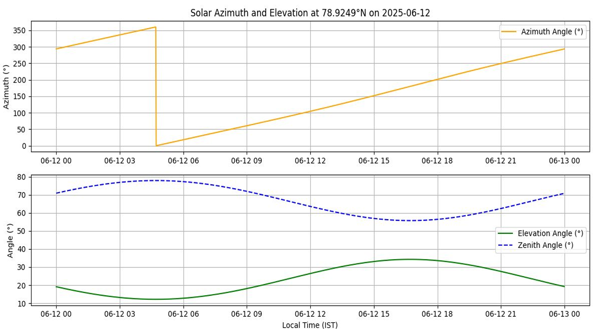
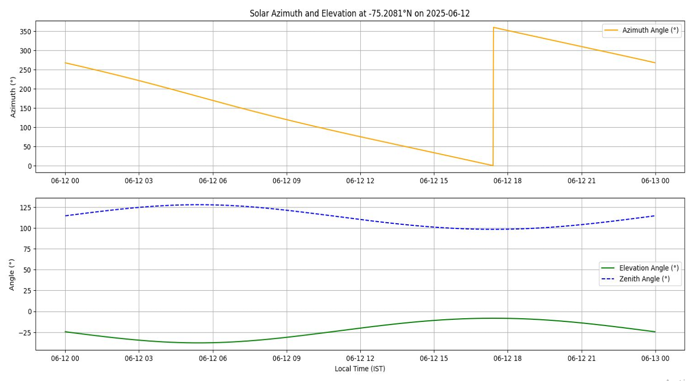

# Solar Position Calculator

This project implements a high-precision solar position calculator to determine solar azimuth and elevation angles for any geographic location.

# Features
- Implements NREL Solar Position Algorithm
- Uses VSOP87 planetary theory
- Includes corrections for nutation, aberration, and atmospheric refraction
- Minute-by-minute solar position calculations

# Tools Used
Python,
NumPy,
Matplotlib

# python code
[solar_position_algorithm.py](Solar_position_algorithm.py)

# Example Output

# Comparison of NOAA and NREL outputs

# Graphical representation of Elevation and Azimuth angle (PRL)

# Graphical representation of North pole Elevation and Azimuth angle

## Graphical representation of South pole Elevation and Azimuth angle

# Applications
Solar energy systems,
Astronomical calculations,
Satellite tracking
